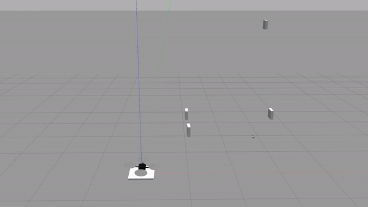

# 16.32 Class Project: Autonomous Drone Racing

Class project for MIT's *Principles of Optimal Control and Estimation* (subject number 16.32).
The project consists in finding the optimal control inputs for an autonomous drone to finish a race – which consists of a set of gates – as fast as possible. The folder [Aleix_16.32_Project](Aleix_16.32_Project) contains the submitted materials. The paper can be found [here](Aleix_16.32_Project/report.pdf) and the video [here](video/optimal_control_drone_racing.mp4) (click on "Download" to visualize).

